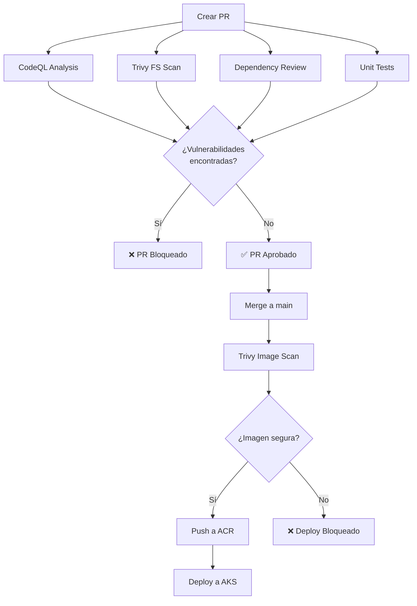

# 🔒 Guía de Seguridad - GitHub Advanced Security

## 🎯 Implementación de Seguridad

Este proyecto implementa múltiples capas de seguridad usando **GitHub Advanced Security (GHAS)** y **Trivy**:

### ✅ Componentes de Seguridad Implementados

#### 1. **CodeQL (SAST - Static Application Security Testing)**
- **Archivo**: `.github/workflows/codeql.yml`
- **Función**: Análisis estático de código Java
- **Ejecución**: 
  - En cada push a `main`
  - En cada Pull Request a `main`
  - Semanalmente los lunes a las 6am UTC
- **Queries**: `security-extended` y `security-and-quality`
- **Resultado**: Genera alertas en la pestaña "Security" → "Code scanning"

#### 2. **Trivy Filesystem Scan (SCA - Software Composition Analysis)**
- **Ubicación**: Job `build-and-test` en `.github/workflows/ci-cd.yml`
- **Función**: Escanea dependencias de Maven (pom.xml) en busca de CVEs
- **Severidad**: CRITICAL y HIGH
- **Acción**: Falla el pipeline si encuentra vulnerabilidades críticas (`exit-code: 1`)
- **Resultado**: Sube resultados a GitHub Security (formato SARIF)

#### 3. **Trivy Image Scan**
- **Ubicación**: Job `build-docker-image` en `.github/workflows/ci-cd.yml`
- **Función**: Escanea la imagen Docker construida antes de subirla a ACR
- **Severidad**: CRITICAL y HIGH
- **Acción**: Bloquea el push si encuentra vulnerabilidades
- **Resultado**: Sube resultados a GitHub Security (formato SARIF)

#### 4. **Dependabot**
- **Archivo**: `.github/dependabot.yml`
- **Función**: Monitoreo continuo de dependencias vulnerables
- **Escanea**:
  - Dependencias Maven (Spring Boot, JUnit, etc.)
  - GitHub Actions
  - Dockerfile base images
- **Frecuencia**: Semanal (lunes 6am UTC)
- **Acción**: Crea PRs automáticos para actualizar dependencias

#### 5. **Dependency Review**
- **Función**: GitHub lo ejecuta automáticamente en PRs
- **Acción**: Compara dependencias entre ramas y alerta sobre nuevas vulnerabilidades

---

## 🔄 Flujo de Seguridad en Pull Requests

Cuando creas un PR de `feature` → `main`:



### Orden de Ejecución:

1. **En el PR** (antes de merge):
   - ✅ CodeQL SAST (análisis de código)
   - ✅ Trivy Filesystem (dependencias)
   - ✅ Dependency Review (GitHub automático)
   - ✅ Unit Tests
   
2. **Después del merge a main**:
   - ✅ Build del código
   - ✅ Construcción de imagen Docker
   - ✅ Trivy Image Scan
   - ✅ Push a ACR (solo si pasa Trivy)
   - ✅ Deploy a AKS

---

## 📋 Configuración de Branch Protection

Para que los checks de seguridad bloqueen PRs, configura en GitHub:

1. Ve a **Settings** → **Branches** → **Branch protection rules** → `main`

2. Habilita:
   - ✅ **Require status checks to pass before merging**
   - Selecciona estos checks obligatorios:
     - `Analyze Java Code` (CodeQL)
     - `Build and Test` (incluye Trivy FS Scan)
     - `dependency-review` (GitHub automático)

3. Habilita:
   - ✅ **Require approvals** (1 aprobación)
   - ✅ **Dismiss stale pull request approvals when new commits are pushed**

---

## 🚨 Ver Resultados de Seguridad

### En GitHub:

1. **Code Scanning Alerts**: 
   - `Security` → `Code scanning` → Ver alertas de CodeQL y Trivy

2. **Dependabot Alerts**: 
   - `Security` → `Dependabot` → Ver dependencias vulnerables

3. **Secret Scanning** (si está habilitado):
   - `Security` → `Secret scanning` → Ver secretos expuestos

### En el PR:

- Los checks de seguridad aparecen en la sección "Checks"
- Si fallan, el botón "Merge" se deshabilita
- Puedes ver los detalles haciendo clic en "Details"

---

## 🛠️ Solución de Problemas

### Si CodeQL falla:

```bash
# Ver logs del workflow
gh run view <run-id> --log

# Común: error de compilación
# Solución: Verifica que `mvn clean compile` funcione localmente
```

### Si Trivy encuentra vulnerabilidades:

```bash
# Escanear localmente
docker run --rm -v $(pwd):/workspace aquasecurity/trivy fs /workspace

# Para imágenes
docker build -t test-image .
docker run --rm aquasecurity/trivy image test-image
```

**Opciones**:
1. Actualizar dependencias vulnerables en `pom.xml`
2. Cambiar la severidad en el workflow a solo `CRITICAL`
3. Agregar excepciones en `.trivyignore` (solo si es falso positivo)

### Si Dependabot no crea PRs:

1. Verifica que Dependabot esté habilitado: `Settings` → `Security & analysis` → `Dependabot alerts`
2. Reemplaza `"tu-usuario-github"` en `.github/dependabot.yml` con tu usuario real
3. Fuerza un escaneo: `Security` → `Dependabot` → `Check for updates`

---

## 📊 Métricas de Seguridad

GitHub genera automáticamente:

- **Security Overview**: `Security` → Resumen de alertas
- **Insights**: `Insights` → `Dependency graph` → Ver todas las dependencias
- **Security Advisories**: Notificaciones de nuevas CVEs

---

## 🎓 Referencias

- [GitHub Advanced Security Docs](https://docs.github.com/en/code-security)
- [CodeQL Documentation](https://codeql.github.com/docs/)
- [Trivy Documentation](https://aquasecurity.github.io/trivy/)
- [Dependabot Configuration](https://docs.github.com/en/code-security/dependabot)

---

## 🔐 Checklist de Seguridad

- [x] CodeQL configurado para SAST
- [x] Trivy configurado para SCA (dependencias)
- [x] Trivy configurado para escaneo de imágenes
- [x] Dependabot configurado para actualizaciones automáticas
- [x] Branch protection rules configuradas
- [x] Status checks obligatorios en PRs
- [ ] Secret scanning habilitado (requiere GitHub Enterprise)
- [ ] Private vulnerability reporting habilitado

**Nota**: Secret scanning y algunas features avanzadas requieren GitHub Enterprise o repositorio público.
